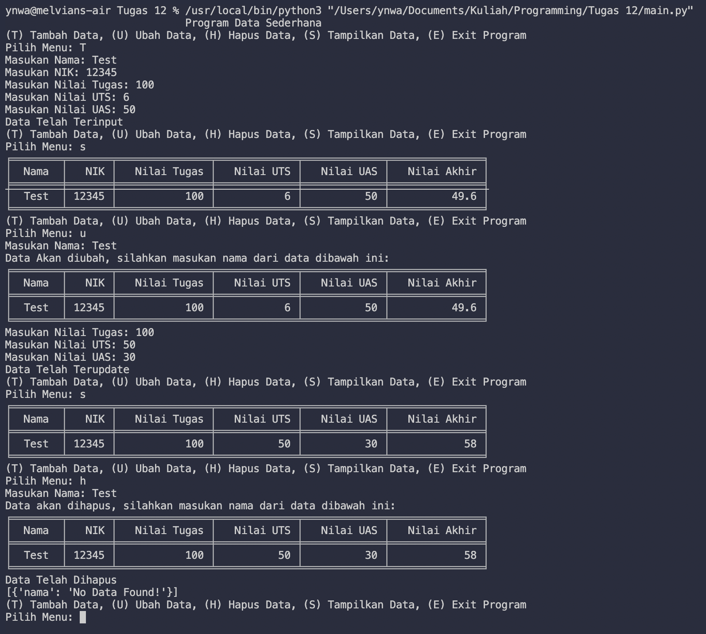
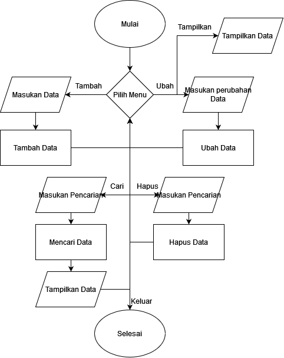

# <p align="center"> TUGAS PEMROGRAMAN Pertemuan 12 - Main.py & Method.py
[](https://www.linkedin.com/in/melvian-wijaya-760b371b1/)


<br>


# [Main.py](https://github.com/melviandanuw/TugasKelilingLuasLingkaran/blob/main/tugas.py)

<p align="justify">Program Data sederhana menggunakan Function, List & Dictionary dengan menu Tambah, Ubah, Tampilkan, Hapus, dan Cari.

- Import class Method dan memanggil class tersebut.
```sh
from method import *;

method = method(); 
```
- Menggunakan perulangan While, selama masih true maka program akan tetap berjalan.
```sh
while (True):
```
- Menggunakan If Else untuk menentukan menu.
```sh
if inputs == 't':
```
- Memanggil function yang berada di class Method.
```sh
method.ubah(inputNamaUpdate);
```
----

# [Method.py](https://github.com/melviandanuw/TugasKelilingLuasLingkaran/blob/main/tugas.py)

<p align="justify">Berisi daftar function yang dipakai pada class Main.

- Import Tabulate untuk membuat table.
```sh
from tabulate import tabulate; 
```
- Membuat List dengan Dictionary.
```sh
datas = [{
    'nama' : 'No Data Found!'    
    }];
```
- Membuat class.
```sh
class method:
```
- Membuat function dengan parameter Self.
```sh
def tambah(self):
        inputNama = str(input('Masukan Nama: '));
        inputNik = int(input('Masukan NIK: '));
        inputNilaiTugas = int(input('Masukan Nilai Tugas: '));
        inputNilaiUTS = int(input('Masukan Nilai UTS: '));
        inputNilaiUAS = int(input('Masukan Nilai UAS: '));
        
        nilaiAkhir = (inputNilaiTugas * 0.30) + (inputNilaiUAS * 0.35) + (inputNilaiUTS * 0.35);
        
        if datas[0]['nama'] == 'No Data Found!':
            del datas[0];
            
        dataAppend = {'nama' : inputNama, 'nik' : inputNik, 'nTugas' : inputNilaiTugas, 'nUTS' : inputNilaiUTS, 'nUAS' : inputNilaiUAS, 'nAkhir' : nilaiAkhir};    
        datas.append(dataAppend);
        print('Data Telah Terinput');
        # print(datas);
```
----

# Hasil Output TugasPraktikum.py


# Flowchart


